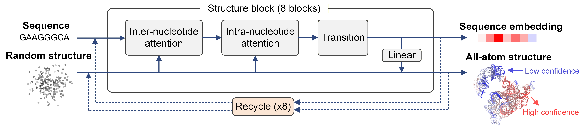

# NUMonomer

NUMonomer is an accurate and efficient end-to-end deep-learning framework for predicting the three-dimensional structures of **RNA** and **single-stranded DNA (ssDNA)** directly from their primary sequences. Its ability to operate without relying on auxiliary features, combined with its highly computationally efficient architecture, enables NUMonomer to predict the structure of a 5,000-base-pair nucleic acid within 20 seconds on a single H100-PCIe GPU. This package provides an implementation of the inference pipeline of NUMonomer.

<p align="center">
  
</p>

## Contents

- [Installation](#installation)
- [Optional acceleration](#optional-acceleration)
- [Pretrained weights](#pretrained-weights)
- [Repository structure](#repository-structure)
- [Input format](#input-format)
- [Quick start](#quick-start)
- [Command-line arguments](#command-line-arguments)
- [Output files](#output-files)
- [Prediction selection and confidence](#prediction-selection-and-confidence)
- [Long-sequence inference](#long-sequence-inference)
- [Reproducibility](#reproducibility)
- [Troubleshooting](#troubleshooting)
- [Citation](#citation)
- [License](#license)
- [Contact](#contact)

## Installation

### Tested environment

The inference pipeline has been tested with the following package versions:

- Python 3.12
- PyTorch 2.11
- Biopython 1.87
- NumPy 2.4.3
- ml-collections 1.1.0

### Create an environment

Using Conda is recommended:

```bash
conda create -n numonomer python=3.12 -y
conda activate numonomer
```

Install PyTorch using a build compatible with your CUDA driver, and then install the remaining dependencies:

```bash
pip install torch
pip install biopython numpy ml-collections
```

Clone the repository and enter the project directory:

```bash
git clone <YOUR_REPOSITORY_URL>
cd NUMonomer
```

> **Note:** GPU inference is strongly recommended. The current inference script defaults to `cuda:0` and uses mixed-precision computation with `bfloat16`. CPU inference may be substantially slower and can depend on hardware and PyTorch support for the selected operations.

## Optional acceleration

The confidence module uses native attention computation by default. When supported by the local CUDA and PyTorch environment, optional attention kernels can reduce GPU memory usage and improve inference speed.

Possible acceleration options include:

- FlashAttention;
- DS4Sci EvoformerAttention from DeepSpeed;
- PyTorch model compilation.

After installing the required optional dependencies, the corresponding settings can be enabled in the configuration, for example:

```python
config.inference.use_dsattn = True
config.inference.disable_compile = False
```

The exact installation procedure depends on the CUDA toolkit, compiler, GPU architecture, and PyTorch version. Verify compatibility before enabling these options.

## Pretrained weights

Download the pretrained NUMonomer model weights from Google Drive:

[Download NUMonomer weights](https://drive.google.com/drive/folders/1K9fG3ndV2UH3atwyrxHDqPN-oHyvhRwG?usp=sharing)

Place the downloaded checkpoint in the `weights/` directory, for example:

```text
weights/NUMonomer.pt
```

## Repository structure

```text
NUMonomer/
├── config.py
├── dataset.py
├── LICENSE
├── model.py
├── modules.py
├── prediction.py
├── README.md
├── structure_module.py
├── __init__.py
│
├── assets/
│   └── NUMonomer_overview.png
│
├── example/
│   ├── test.fasta
│   └── test.pdb
│
├── np/
│   ├── residue_constants.py
│   └── __init__.py
│
├── utils/
│   ├── check_input.py
│   ├── rigid_utils.py
│   ├── save_struc.py
│   ├── seq_utils.py
│   └── __init__.py
│
└── weights/
    └── NUMonomer.pt
```

## Input format

NUMonomer accepts either:

1. a single sequence file through `--seq_file`; or
2. a directory containing sequence files through `--seq_path`.

The two options are mutually exclusive. Exactly one must be provided.

Each FASTA header must use the following format:

```text
>CHAIN_ID|MOLECULE_TYPE
```

where:

- `CHAIN_ID` is the chain identifier used in the output structure;
- `MOLECULE_TYPE` must be either `rna` or `dna`.

### RNA example

```fasta
>A|rna
GGGAGACCGGAAUUCUGGUCCGAGUAGAGUGUGAGCUCCGUAACUAGUCGCGU
```

### ssDNA example

```fasta
>A|dna
GGGAGACCGGAATTCTGGTCCGAGTAGAGTGTGAGCTCCGTAACTAGTCGCGT
```

Remove all spaces from the sequence before running inference. RNA sequences should use `U`, whereas DNA sequences should use `T`.

## Quick start

### Predict one target

```bash
python -u prediction.py \
  --seq_file ./example/test.fasta \
  --save_path ./results \
  --weight ./weights/NUMonomer.pt \
  --ftype cif \
  --device cuda:0
```

### Predict all targets in a directory

```bash
python -u prediction.py \
  --seq_path ./example \
  --save_path ./results \
  --weight ./weights/NUMonomer.pt \
  --ftype cif \
  --device cuda:0 \
  --ncpu 8
```

The script validates the supplied input files before constructing the inference dataset.

## Command-line arguments

| Argument | Default | Required | Description |
|---|---:|:---:|---|
| `--seq_file`, `-seq_file` | `None` | No* | Path to one input sequence file. Mutually exclusive with `--seq_path`. |
| `--seq_path`, `-seq_path` | `None` | No* | Directory containing input sequence files. Mutually exclusive with `--seq_file`. |
| `--save_path`, `-save_path` | `None` | Yes | Directory in which target-specific output folders are created. |
| `--weight`, `-weight` | `None` | Yes | Path to the pretrained model checkpoint. |
| `--ftype`, `-ftype` | `cif` | Yes | Requested structure serialization format: `cif` or `pdb`. |
| `--device`, `-device` | `cuda:0` | No | PyTorch device used for inference. |
| `--seed`, `-seed` | `42` | No | Random seed for Python, NumPy, and PyTorch. |
| `--last`, `-last` | disabled | No | Export the final recycling iteration instead of the confidence-selected iteration. |
| `--ncpu`, `-ncpu` | `8` | No | Number of CPU threads and post-processing workers. |
| `--split_seq`, `-split_seq` | `0` | No | Enable sequence-dimension chunking to reduce peak memory usage. `0` disables chunking. |
| `--split_atom`, `-split_atom` | `0` | No | Enable atom-dimension chunking to reduce peak memory usage. `0` disables chunking. |
| `--num_iter`, `-num_iter` | `8` | No | Number of structure-recycling iterations. |
| `--clamp_plddt`, `-clamp_plddt` | `512` | No | Number of leading residues used for the confidence calculation. |

\* Supply either `--seq_file` or `--seq_path`, but not both.

## Output files

For each target, NUMonomer creates a target-specific directory under `--save_path`.

A typical output layout is:

```text
results/
└── <target_name>/
    ├── pred_NUMonomer_42.cif
    └── log_NUMonomer_42.json
```

The exact filename contains:

- the checkpoint filename stem;
- the random seed;
- the selected structure format.

The structure file contains the predicted atomic coordinates. Per-residue confidence values are written to the B-factor field by the structure writer.

The JSON log contains fields similar to:

```json
{
  "timming": " 12.34",
  "plddt": [" 72.1", " 74.8", " 77.3", " 78.0"],
  "len_seq": "   256",
  "target": "example_target",
  "idx_coords": [3]
}
```

In the current script, the key is written as `timming`; this spelling is retained here to match the implementation.

## Prediction selection and confidence

By default, the script evaluates the mean predicted pLDDT score across recycling iterations and exports a confidence-selected structure.

To export the final recycling iteration instead, add `--last`:

```bash
python -u prediction.py \
  --seq_file ./example/test.fasta \
  --save_path ./results \
  --weight ./weights/NUMonomer.pt \
  --ftype cif \
  --device cuda:0 \
  --last
```

Using `--last` can reduce confidence-selection overhead, but the final iteration is not necessarily the iteration with the highest predicted confidence.

> **Implementation note:** the current confidence-selection code assumes that at least four recycling outputs are available. Keep `--num_iter` at `4` or higher when using the default confidence-based selection. When using fewer iterations, enable `--last` or update the selection logic accordingly.

## Long-sequence inference

NUMonomer is designed to process sequences spanning thousands of nucleotides. Peak memory usage nevertheless depends on sequence length, model configuration, recycling iterations, attention implementation, and hardware.

Chunked inference can be enabled with:

```bash
--split_seq <positive_integer>
--split_atom <positive_integer>
```

Both options default to `0`, which disables chunking and generally provides the highest throughput at the cost of greater peak memory usage. Positive values enable chunked computation and can reduce GPU memory consumption, although inference may become slower.

Example for a long target:

```bash
python -u prediction.py \
  --seq_file ./example/long_target.fasta \
  --save_path ./results_long \
  --weight ./weights/NUMonomer.pt \
  --ftype cif \
  --device cuda:0 \
  --split_seq 128 \
  --split_atom 2 \
  --num_iter 8 \
  --clamp_plddt 512
```

Additional memory-saving strategies include:

- enabling `--last`;
- reducing `--num_iter`, while keeping the implementation note above in mind;
- adjusting `--clamp_plddt`;
- enabling a supported memory-efficient attention backend.

These changes can affect speed, confidence estimation, or prediction quality and should be validated for the intended application.

## Reproducibility

The `--seed` option initializes random-number generators for:

- Python's `random` module;
- NumPy;
- PyTorch CPU operations; and
- PyTorch CUDA operations.

Example:

```bash
python -u prediction.py \
  --seq_file ./example/test.fasta \
  --save_path ./results_seed_2026 \
  --weight ./weights/NUMonomer.pt \
  --ftype cif \
  --device cuda:0 \
  --seed 2026
```

Exact reproducibility can still depend on the PyTorch and CUDA versions, GPU hardware, compiler settings, and nondeterministic kernels.

## Troubleshooting

### No valid input files are detected

Check that:

- exactly one of `--seq_file` and `--seq_path` is provided;
- the input path exists;
- each FASTA header follows `>CHAIN_ID|rna` or `>CHAIN_ID|dna`;
- RNA sequences use `U` and DNA sequences use `T`;
- the sequence contains no spaces or unsupported characters.

### CUDA out-of-memory error

Try one or more of the following:

```bash
--split_seq 128 --split_atom 2 --last
```

You can also reduce `--num_iter` or `--clamp_plddt`, subject to the implementation notes above.

### The requested output format and filename extension differ

The current `prediction.py` constructs the prediction filename with a `.cif` suffix before calling the structure writer. When using `--ftype pdb`, update the filename construction so that the suffix matches the selected format.

For example:

```python
suffix = "pdb" if cfg.ftype == "pdb" else "cif"
save_file = os.path.join(
    entry_path,
    f"pred_{weight_name}_{seed}.{suffix}",
)
```

### PyTorch autocast reports an invalid device type

Some PyTorch versions require `torch.autocast` to receive `cuda` rather than `cuda:0` as its `device_type`. Keep the model device as `cuda:0`, but derive the autocast device type separately when necessary:

```python
autocast_device = torch.device(device).type
with torch.autocast(
    device_type=autocast_device,
    dtype=torch.bfloat16,
    enabled=True,
):
    preds = model(total_feature, last_only=cfg.save_last)
```

## Citation

The complete citation and BibTeX entry will be added after the manuscript becomes publicly available.

```bibtex
@article{NUMonomer2026,
  title   = {NUMonomer enables accurate and efficient nucleic acid structure prediction from primary sequence alone},
  author  = {To be updated},
  journal = {To be updated},
  year    = {2026},
  doi     = {To be updated}
}
```

## License

See [LICENSE](LICENSE) for licensing information.

## Contact

For bug reports, feature requests, and usage questions, please open a GitHub issue.

For direct correspondence, contact [yunda_si@ucas.edu.cn](mailto:yunda_si@ucas.edu.cn).
