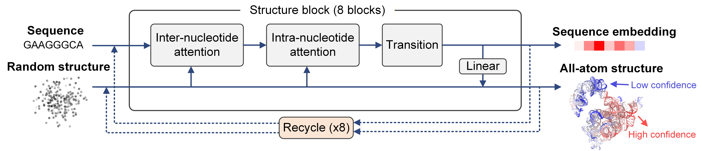

# NUMonomer

<p align="center">
  
</p>

NUMonomer is an end-to-end deep-learning framework for predicting the three-dimensional structures of **RNA** and **single-stranded DNA (ssDNA)** directly from their primary sequences. Its ability to operate without relying on auxiliary features, combined with its highly computationally efficient architecture, enables NUMonomer to predict the structure of a 5,000-base-pair nucleic acid within 20 seconds on a single H100-PCIe GPU. This package provides an implementation of the inference pipeline of NUMonomer.

## Update:
v1.1.0   Added support for circular RNA structure prediction using the 
cyclic offset relative positional encoding introduced in [AfCycDesign](https://github.com/sokrypton/ColabDesign/tree/main).

## Installation

### 1. Create a Python environment

```bash
conda create -n numonomer python=3.12 -y
conda activate numonomer
```

### 2. Install Python dependencies

```bash
pip install torch
pip install biopython numpy ml-collections
```
Tested versions:

- Python 3.12
- PyTorch 2.11
- Biopython 1.87
- NumPy 2.4.3
- ml-collections 1.1.0

### 3. Clone the repository

```bash
git clone https://github.com/yunda-si/NUMonomer.git
cd NUMonomer
```

> **Note:** GPU inference is strongly recommended. The inference script defaults to `cuda:0` and uses mixed-precision computation with `bfloat16`.
>


### 4. Download model weights
Download the [NUMonomer checkpoints](https://drive.google.com/drive/folders/1K9fG3ndV2UH3atwyrxHDqPN-oHyvhRwG?usp=sharing) and place them in `./weights`:

```text
weights/NUMonomer.pt
```

## Optional acceleration

The confidence module uses native attention by default. Optional attention kernels can reduce GPU memory usage and improve inference speed:

- [FlashAttention](https://github.com/dao-ailab/flash-attention);
- [DS4Sci EvoformerAttention](https://www.deepspeed.ai/tutorials/ds4sci_evoformerattention/);
- PyTorch model compilation.

After installing the required optional dependencies, the corresponding settings can be enabled in the `config.py`:

```python
config.inference.use_dsattn = True
config.inference.disable_compile = False
```


## Input format

NUMonomer accepts either --seq_file or --seq_path. The two options are mutually exclusive.
Each FASTA header should follow:

```text
>CHAIN_ID|MOLECULE_TYPE|TOPOLOGY
GGGAGACCGGAAUUCUGGUCCGAGUAGAGUGUGAGCUCCGUAACUAGUCGCGU
```

where:

- `CHAIN_ID` is the chain identifier used in the output structure (A);
- `MOLECULE_TYPE` must be either `rna` or `dna`.
- `TOPOLOGY` must be either `linear` or `circular`.


## Quick start

### Predict one target

```bash
python -u prediction.py \
  --seq_file ./example/test.fasta \
  --save_path ./results \
  --weight ./weights/NUMonomer.pt \
  --ftype cif \
  --device cuda:0
```

### Predict all targets in a directory

```bash
python -u prediction.py \
  --seq_path ./example \
  --save_path ./results \
  --weight ./weights/NUMonomer.pt \
  --ftype cif \
  --device cuda:0 \
  --ncpu 8
```

## Command-line arguments

| Argument | Default | Required | Description                                                                           |
|---|---:|:---:|---------------------------------------------------------------------------------------|
| `--seq_file` | `None` | No* | Path to one input sequence file. Mutually exclusive with `--seq_path`.                |
| `--seq_path` | `None` | No* | Directory containing input sequence files.       |
| `--save_path` | `None` | Yes | Directory in which target-specific output folders are created.                        |
| `--weight` | `None` | Yes | Path to the pretrained model checkpoint.                                              |
| `--ftype` | `cif` | Yes | structure format: `cif` or `pdb`.                                                     |
| `--device` | `cuda:0` | No | Device used for inference.                                                            |
| `--seed` | `42` | No | Random seed for Python, NumPy, and PyTorch.                                           |
| `--last` | disabled | No | Export the final recycling iteration instead of the confidence-selected iteration.    |
| `--ncpu` | `8` | No | Number of CPU threads.                                    |
| `--split_seq` | `0` | No | Enable sequence-dimension chunking to reduce peak memory usage. `0` disables chunking. |
| `--split_atom` | `0` | No | Enable atom-dimension chunking to reduce peak memory usage. `0` disables chunking.    |
| `--num_iter` | `8` | No | Number of structure-recycling iterations.                                             |
| `--clamp_plddt` | `512` | No | Number of leading residues used for the confidence calculation.                       |


## Prediction selection and confidence

By default, NUMonomer exports the confidence-selected structure based on mean predicted pLDDT across recycling iterations.
Use --last to export the final recycling iteration.

```bash
python -u prediction.py \
  --seq_file ./example/test.fasta \
  --save_path ./results \
  --weight ./weights/NUMonomer.pt \
  --ftype cif \
  --device cuda:0 \
  --last
```


## Long-sequence inference

Chunked inference can be enabled with:

```bash
--split_seq <positive_integer>
--split_atom <positive_integer>
```

Both options default to `0`, which disables chunking. Positive values enable chunked computation and can reduce GPU memory consumption.

Example for a long target:

```bash
python -u prediction.py \
  --seq_file ./example/long_target.fasta \
  --save_path ./results_long \
  --weight ./weights/NUMonomer.pt \
  --ftype cif \
  --device cuda:0 \
  --split_seq 128 \
  --split_atom 2 \
  --num_iter 8 \
  --clamp_plddt 512
```

## Citation

```bibtex
@article{NUMonomer2026,
  title   = {NUMonomer enables accurate and efficient nucleic acid structure prediction from primary sequence alone},
  author  = {Yunda Si, Suqi Zhang, Luonan Chen},
  journal = {bioRxiv},
  year    = {2026},
  doi     = {https://doi.org/10.64898/2026.07.20.739453}
}
```


## Contact

For bug reports, feature requests, and usage questions, open a GitHub issue or contact [yunda_si@ucas.edu.cn](mailto:yunda_si@ucas.edu.cn).
